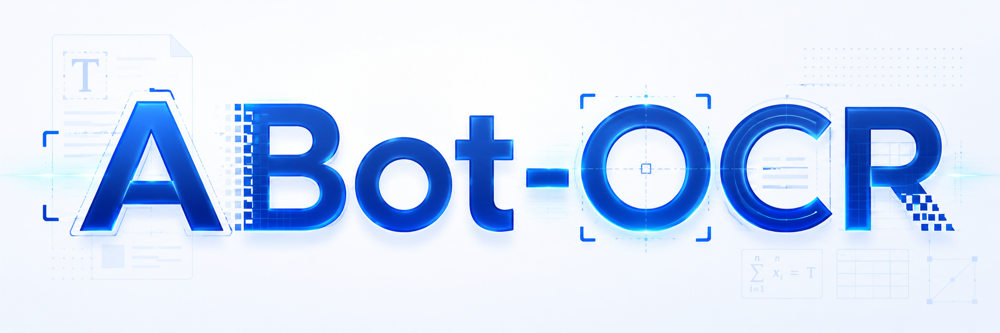
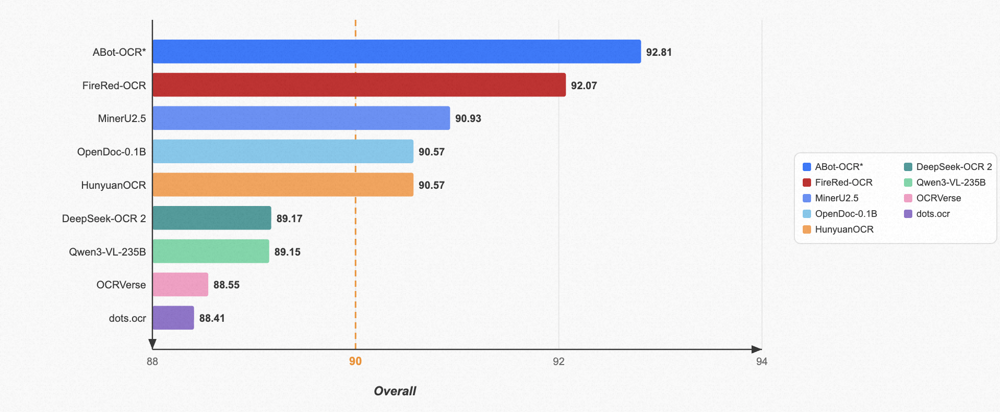

<div align="center">



<br>

**High-precision conversion of document page images to structured Markdown**

<br>

[](./report/ABot_OCR_Technical_Report.pdf)
[](https://www.python.org/)
[](https://huggingface.co/acvlab/ABot-OCR)
[](#-inference)

[中文文档](./README_ZH.md)

</div>

---

## 📖 Overview

ABot-OCR is a document-image OCR model that converts PDF / document page images into structured **Markdown**, recognizing and preserving text, mathematical formulas (LaTeX), tables (HTML), and related layout elements.

<!-- TODO: Add 1–2 paragraphs on model background, training data, and use cases -->

---

## 🏆 Benchmark Results

<!-- TODO: Add benchmark name, evaluation setup, and comparison notes -->
The figure below shows overall evaluation results on the [OmniDocBench v1.5](https://github.com/opendatalab/OmniDocBench/tree/main) dataset.

<div align="center">



<br>
<sub><!-- TODO: Figure caption, e.g. OmniDocBench overall metric comparison --></sub>

</div>

<!-- TODO: Optional — add per-scenario / per-language metric tables
| Benchmark | Metric | ABot-OCR | Notes |
| :--- | :---: | :---: | :--- |
| TODO | TODO | TODO | |
-->

---

## 📦 Model Download

Model weights are large and are not bundled in this repository. Download them from Hugging Face and place them locally:

| Model | Platform | Link |
| :--- | :---: | :--- |
| **ABot-OCR** | 🤗 Hugging Face | [`acvlab/ABot-OCR`](https://huggingface.co/acvlab/ABot-OCR) |


```text
repo/
└── abot-ocr/          # Extract / place downloaded weights here
    ├── config.json
    ├── model.safetensors
    └── ...
```

---

## 🚀 Quick Start

### Requirements

We recommend **Python 3.11+** and the following dependencies:

```bash
pip install vllm==0.18.0 transformers==5.5.4 torch==2.10.0
```

> **Note:** Inference loads the model with vLLM and requires sufficient GPU memory (~4GB weights; actual usage depends on `batch_size` and image resolution).

### Run Inference

1. Download model weights to `./abot-ocr/`
2. Prepare images to recognize (a single file or a directory)
3. Run the inference script:

```bash
python abot-ocr-infer.py
```

By default, images are read from `images/` and Markdown results are written to `./abot-ocr-infer-output/`.

---

## 💻 Inference

Inference script: [`abot-ocr-infer.py`](./abot-ocr-infer.py)

### Model Path

The script loads the model from the same directory by default. To change it:

```python
MODEL_PATH = str(Path(__file__).resolve().parent / "abot-ocr")
```

### Custom Input / Output

Edit the parameters in the `__main__` block at the bottom of `abot-ocr-infer.py`:

```python
run_infer(
    input_path="images",                  # Single image or directory (nested subdirs supported)
    llm=llm,
    processor=processor,
    sampling_params=sampling_params,
    batch_size=8,                         # Images per batch; 0 = infer all at once
    output_dir="./abot-ocr-infer-output"  # Omit to write .md next to each image
)
```

### Input & Output Behavior

| Behavior | Description |
| :--- | :--- |
| Default output | One `.md` file per image (same basename) |
| `output_dir` set | Write to the given directory, preserving relative subpaths |
| Resume | Images that already have a matching `.md` are skipped |
| Failures | Unreadable images are logged to `failed_images.log` |


---

## 📄 Citation

<!-- TODO: Fill in authors and official citation details -->

```bibtex
@misc{abot-ocr,
  title  = {ABot-OCR},
  author = {TODO},
  year   = {2026},
}
```

---

## 🙏 Acknowledgments

Our work is inspired by many excellent open-source projects. We sincerely thank the developers of [Qwen-VL](https://github.com/QwenLM/Qwen-VL), [PaddleOCR-VL](https://github.com/PaddlePaddle/PaddleOCR), [MinerU](https://github.com/opendatalab/MinerU), and the broader OCR community.
